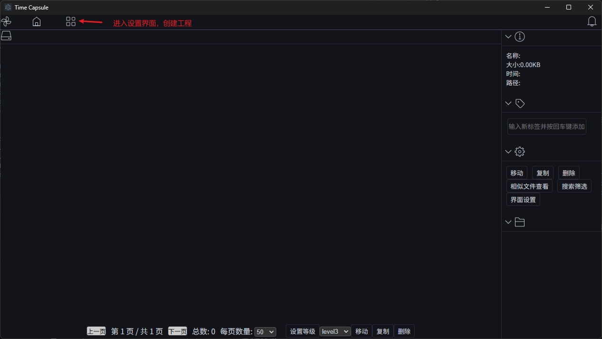
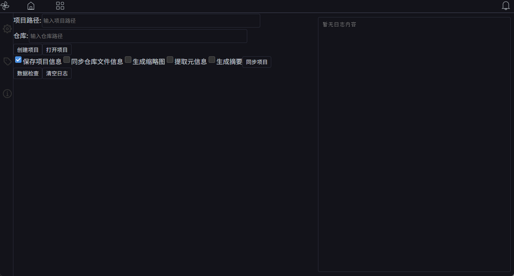
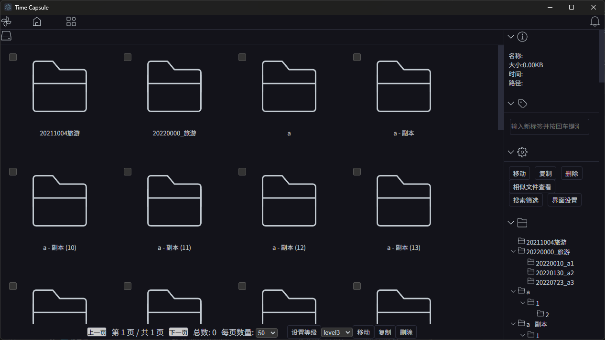
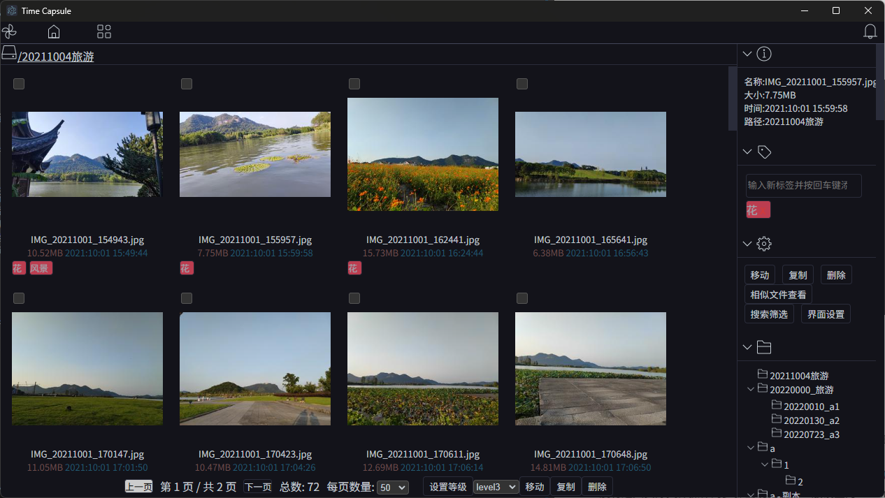

# time capsule

`time capsule`程序的功能是用来管理用户的图片，视频等。🎈

他是一个轻量级的工具，无需安装，无需配置，直接运行即可， 删除即卸载。最主要的功能特性就是`不会侵入用户的文件数据，除非用户主动删除，复制，移动`。💪

## 🧊功能特性

`time capsule`的功能特性如下：

- 轻量级，无需安装，无需配置，直接运行即可， 删除即卸载。
- 支持web端 和桌面端。
- 用户自定义存储路径
- 不入侵用户原始文件数据（即不会对用户文件数据做任何修改），除非用户主动删除，复制，移动。
- 工程文件随时删除，随时备份。
- 支持文件的标签管理。
- 支持查看文件的详细信息。
- 支持文件多种条件搜索。
- 支持文件/文件夹的复制，移动，删除操作。

## 🧊功能使用说明

1，打开程序

2，进入设置界面，创建工程

**项目路径**：项目配置文件路径，包括数据库，缩略图等信息，文件元数据信息等路径。

**仓库**：图片/视频文件的路径。

设置好上面两个路径信息之后，点击创建项目。

创建项目成功之后，点击同步项目。

自此，项目项目创建成功，可返回主页，查看预览文件。

3，预览文件

