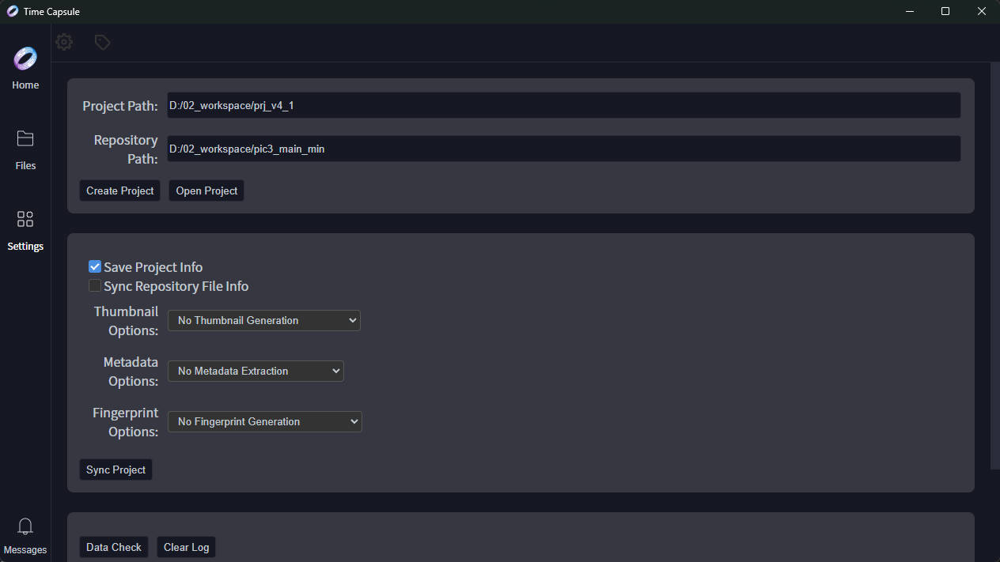
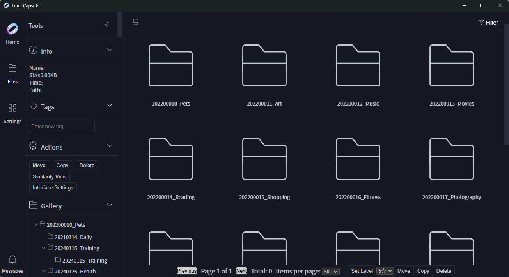
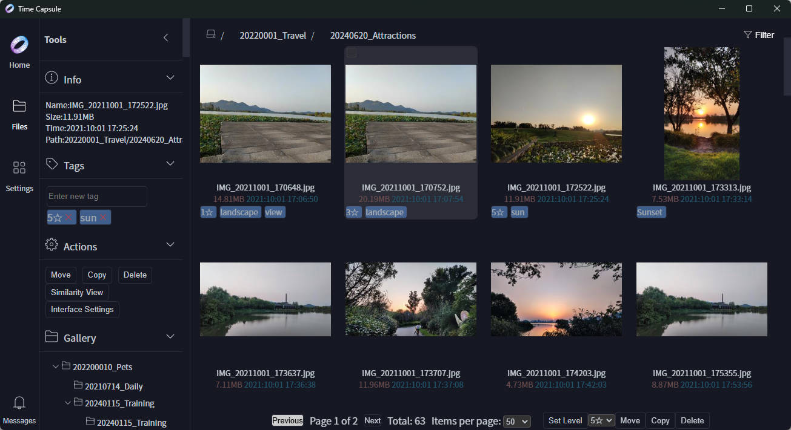

[English](doc/README-en.md)  |  [简体中文](doc/README-zh.md)

# Time Capsule User Manual

## 📖 Table of Contents

- [Product Overview](#product-overview)
- [System Requirements](#system-requirements)
- [Quick Start](#quick-start)
- [Core Features](#core-features)
  - [File Management](#file-management)
  - [Tag System](#tag-system)
  - [Search and Filter](#search-and-filter)
  - [Similarity Detection](#similarity-detection)
- [Advanced Features](#advanced-features)
  - [Metadata Management](#metadata-management)
  - [File Fingerprinting](#file-fingerprinting)
  - [Database Management](#database-management)
  - [Real-time Updates](#real-time-updates)
  - [Async Tasks](#async-tasks)
- [Best Practices](#best-practices)
- [FAQ](#faq)
- [Technical Support](#technical-support)

---

## Product Overview

Time Capsule is a professional image and video management tool designed to help users efficiently organize and browse multimedia files.

### Core Philosophy

**Non-intrusive design** is the core philosophy of Time Capsule. Unless users actively perform delete, copy, or move operations, the system will not modify users' original file data in any way. All metadata, thumbnails, fingerprints, and other information are stored independently in the project directory, ensuring the integrity and security of original files.

### Product Positioning

- **Lightweight and Portable**: No installation or configuration required, ready to use, delete to uninstall
- **Multi-platform Support**: Supports both web and desktop access
- **Safe and Reliable**: Zero-modification principle to protect user data security
- **Efficient and Convenient**: Smart search, batch operations, real-time updates

### Use Cases

- **Photography Enthusiasts**: Manage large numbers of photos, categorize by tags, quick search
- **Video Creators**: Organize video footage, manage different versions
- **Data Archiving**: Build personal digital asset libraries for long-term management
- **Team Collaboration**: Share file libraries, unified resource management

---

## System Requirements

### Hardware Requirements

- **Processor**: Intel Core i3 or equivalent performance processor
- **Memory**: 4GB or more recommended
- **Storage**: At least 1GB available space (for storing project data and cache)

### Software Requirements

- **Operating System**: Windows 7/8/10/11 (64-bit)
- **Browser**: Chrome 80+, Firefox 75+, Edge 80+ (Web version)
- **Other**: No additional database or runtime environment installation required

### Recommended Configuration

- **Processor**: Intel Core i5 or higher
- **Memory**: 8GB or more
- **Storage**: SSD hard drive to improve file scanning and thumbnail generation speed

---

## Quick Start

### 1. Launch the Program

Double-click the Time Capsule executable to launch the program. The settings interface will automatically open on first launch.

### 2. Create a Project

#### Step Instructions

1. Enter the settings interface and click "Create Project"
2. Configure the project path and repository path
3. Click the "Create Project" button

#### Path Configuration

**Project Path**: Path to store project configuration files, including:
- Database files (.db)
- Thumbnail cache
- File metadata
- System configuration files

**Repository**: Original path to store image/video files. It is recommended to choose a storage location with sufficient capacity and fast read/write speed.



### 3. Sync Project

After successfully creating the project, click the "Sync Project" button to start the first scan. The sync process includes:

- **Scan Repository**: Traverse the repository directory and identify all files and folders
- **Build Index**: Save file information to the database
- **Generate Thumbnails**: Generate preview thumbnails for images and videos (optional)
- **Extract Metadata**: Extract EXIF and other metadata from files (optional)

After synchronization is complete, you can return to the main page to browse and preview files.




### 4. Project Management

#### Open Project

Select an existing project file (JSON format) to open the project.

⚠️ **Note**: After opening a project, you need to restart the software to correctly load project information and file data. Optimization will be provided in the future.

#### Save Project

Save the current project's configuration information to the configuration file, including:
- Project path
- Repository path
- User preference settings

---

## Core Features

### File Management

#### File Browsing

Time Capsule provides an intuitive file browsing interface that supports:
- **Tree View**: Browse by folder hierarchy
- **Grid View**: Thumbnail grid display
- **List View**: Detailed information list display
- **Pagination Loading**: Automatic pagination for large data volumes

#### File Operations

##### Copy Files

Copy files to a specified folder. Operation flow:
1. Select files to copy (supports multiple selection)
2. Click the "Copy" button or use the shortcut `Ctrl + C`
3. Select the target folder
4. Confirm the copy operation

##### Move Files

Move files from one folder to another. Operation flow:
1. Select files to move (supports multiple selection)
2. Click the "Move" button or use the shortcut `Ctrl + X`
3. Select the target folder
4. Confirm the move operation

##### Delete Files

File deletion uses a safe deletion mechanism:
1. Select files to delete (supports multiple selection)
2. Click the "Delete" button or use the shortcut `Delete`
3. The system moves the file to the recycle bin directory

**Recycle Bin Mechanism**:
- Files are moved to the `recycle_bin` folder in the same directory as the repository
- Key information about the file is recorded (original path, deletion time, etc.)
- For permanent deletion, you can manually delete directly in the recycle bin directory

⚠️ **Note**: The current version does not support file recovery functionality.

#### Batch Operations

Time Capsule supports efficient batch operations:
- **Select All**: Supports selecting all files
- **Batch Copy/Move**: Select multiple files for operation simultaneously
- **Batch Delete**: Delete multiple files at once
- **Batch Add Tags**: Add tags to multiple files simultaneously

### Tag System

#### Tag Creation

In the file preview interface, you can add custom tags to files:
1. Select files to add tags to
2. Click the "Add Tag" button
3. Enter the tag name
4. Confirm the addition

#### Tag Operations

##### Add Tags
- Add tags to single or multiple files
- Support quick addition of common tags
- Support creating new tags

##### Delete Tags
- Remove specified tags from files
- Support batch deletion of tags
- Automatically update file list after deletion

##### Tag Management
- Unified management of all tags
- Support tag renaming
- Support tag deletion
- View tag usage statistics

#### Tag Use Cases

- **Categorize by Theme**: Landscape, Portrait, Architecture, Food, etc.
- **Categorize by Time**: 2024, 2023, Holidays, etc.
- **Categorize by Location**: Beijing, Shanghai, Paris, etc.
- **Categorize by Status**: Edited, Pending, Published, etc.

The tag system supports multi-tag combinations. A file can be associated with multiple tags to achieve efficient categorization management.

### Search and Filter

#### Search Functionality

The system provides powerful multi-condition combined search functionality:

##### File Name Search
- Supports fuzzy matching
- Supports wildcards (`*`, `?`)
- Real-time display of search results

##### Tag Filter
- Supports single tag filtering
- Supports multi-tag combination (AND logic)
- Supports tag exclusion (NOT logic)

##### File Type Filter
- Filter by file extension
- Categorize by file type (images, videos, documents, etc.)
- Supports custom file types

##### Date Range Filter
- Filter by file creation date
- Filter by file modification date
- Supports relative dates (last 7 days, last 30 days, etc.)

##### File Size Filter
- Filter by file size range
- Supports preset size options (<1MB, 1-10MB, >10MB, etc.)
- Supports custom size ranges

##### Combined Filter
Supports multi-condition combination for precise search:
- File name + tags + date + size
- Flexible combination to meet various search needs

#### Search Results

- **Real-time Updates**: Results update in real-time when search conditions change
- **Pagination Browsing**: Supports pagination display to improve performance in large data volume scenarios
- **Result Sorting**: Supports sorting by file name, size, date, and other fields

### Similarity Detection

#### Feature Overview

The system provides intelligent similar file detection functionality to help you identify duplicate or similar image/video files.

#### Similarity Calculation

- **Content-based Analysis**: Analyzes actual file content without relying on file names or paths
- **Smart Algorithms**: Uses advanced image/video similarity algorithms
- **Efficient Calculation**: Optimized calculation process for fast processing of large numbers of files

#### Similar File Grouping

- **Automatic Grouping**: Automatically groups and displays similar files
- **Similarity Sorting**: Sorts by similarity level
- **Preview Comparison**: Supports side-by-side preview of similar files

#### Threshold Settings

- **Custom Threshold**: Users can adjust the similarity detection threshold (0-100%)
- **Preset Options**: Provides common threshold presets (strict, medium, loose)
- **Real-time Preview**: Preview detection results in real-time when adjusting the threshold

#### Application Scenarios

##### Deduplication Optimization
Discover and process duplicate files to save storage space:
- Identify completely identical files
- Identify highly similar files
- Support batch deletion of duplicate files

##### Version Management
Identify different shooting versions of the same scene:
- Find multiple photos of the same scene
- Find different edited versions of the same video
- Facilitate selecting the best version

##### Content Organization
Batch organize files with similar content:
- Move similar files to the same folder
- Add unified tags to similar files
- Establish relationships between files

---

## Advanced Features

### Metadata Management

#### EXIF Information Extraction

The system automatically extracts EXIF metadata from image files:

##### Shooting Information
- Shooting time
- Geographic location (GPS coordinates)
- Shooting device information

##### Device Information
- Camera model
- Lens model
- Manufacturer information

##### Shooting Parameters
- Aperture value (F-stop)
- Shutter speed
- ISO sensitivity
- Focal length
- Exposure compensation

##### Image Information
- Image size (resolution)
- Color space
- Compression format

#### Metadata Applications

- **Filter by Time**: Quickly locate photos based on shooting time
- **Filter by Location**: Find photos from specific locations based on GPS information
- **Filter by Device**: Find photos taken with specific cameras or lenses
- **Technical Analysis**: Analyze shooting parameters to improve photography skills

### File Fingerprinting

#### Fingerprint Generation

Generate a unique fingerprint identifier (Hash value) for each file:

- **Algorithm Selection**: Supports multiple Hash algorithms (MD5, SHA-1, SHA-256)
- **Fast Calculation**: Optimized calculation process for efficient processing of large numbers of files
- **Uniqueness Guarantee**: Ensures each file's fingerprint is unique

#### Fingerprint Applications

##### File Deduplication
- Identify completely identical files
- Can identify files even with different names
- Support batch deletion of duplicate files

##### Integrity Verification
- Verify if files have been tampered with
- Detect file transfer errors
- Ensure data integrity

##### Similarity Detection Foundation
- Provide basic data for similarity detection
- Improve detection accuracy
- Accelerate detection speed

### Database Management

#### Database Features

- **SQLite Database**: Lightweight, portable database solution
- **Zero Configuration**: No additional database software installation required
- **High Performance**: Optimized query performance for fast response
- **Cross-platform**: Supports Windows, macOS, Linux

#### Data Management

##### Metadata Storage
Store detailed metadata of files:
- File basic information (name, size, type, path)
- File time information (creation time, modification time, access time)
- File tag information
- File fingerprint information
- File thumbnail path

##### Backup and Recovery
- **Manual Backup**: Supports manual export of database files
- **Automatic Backup**: Configurable automatic backup strategy
- **Recovery Function**: Restore database from backup files
- **Version Management**: Retain multiple backup versions

##### Consistency Check
- **Automatic Check**: Periodically check database consistency
- **Error Repair**: Automatically repair common data inconsistency issues
- **Integrity Verification**: Verify database file integrity

#### User Experience

- **No Refresh Experience**: Get the latest data without manually refreshing the page
- **Instant Feedback**: Operation results displayed immediately
- **Status Visibility**: Real-time view of system running status

### Async Tasks

#### Task Queue

The system has a built-in async task processing mechanism:

- **Task Queue**: Supports multi-task concurrent execution
- **Priority Management**: Supports task priority settings
- **Concurrency Control**: Intelligent scheduling to avoid system overload
- **Task Persistence**: Task information is persisted, supporting resume from interruption

#### Task Types

##### Scan Tasks
- Repository scan
- Incremental scan
- Full scan

##### Processing Tasks
- Thumbnail generation
- Metadata extraction
- Fingerprint generation
- Similarity detection

#### Task Monitoring

##### Status Monitoring
- Real-time monitoring of task execution status
- Display task progress percentage
- Display task remaining time

##### Error Handling
- Comprehensive exception handling mechanism
- Automatic retry of failed tasks
- Detailed error logging

---

## Best Practices

### Project Management

#### Project Planning

- **Single Repository**: It is recommended that one project corresponds to one repository to avoid confusion
- **Regular Backup**: Regularly backup project files and database
- **Path Standardization**: Use standardized folder naming and hierarchical structure

#### Sync Strategy

- **First Sync**: It is recommended to perform a full sync when creating a project for the first time
- **Daily Updates**: It is recommended to perform incremental sync during daily use
- **Regular Full Sync**: Regularly perform full sync to ensure data consistency

### File Organization

#### Folder Structure

It is recommended to adopt a clear folder structure:
```
Repository/
├── 2024/
│   ├── Spring Festival/
│   ├── Summer Vacation/
│   └── Daily/
├── 2023/
│   ├── Spring Festival/
│   └── Daily/
└── Other/
    ├── Work Documents/
    └── Personal Data/
```

#### File Naming

- **Unified Format**: Use a unified file naming format
- **Include Information**: Include key information such as date and location in the file name
- **Avoid Special Characters**: Avoid using special characters and spaces

### Tag Usage

#### Tag Strategy

- **Hierarchical Tags**: Use hierarchical tags (e.g., Travel > Japan > Tokyo)
- **Quantity Control**: Control the number of tags per file to 3-5
- **Unified Standard**: Use a unified tag naming standard

#### Tag Maintenance

- **Regular Cleanup**: Regularly clean up unused tags
- **Tag Merging**: Merge similar or duplicate tags
- **Tag Statistics**: Regularly review tag usage statistics to optimize the tag system

### Performance Optimization

#### Scan Optimization

- **Incremental Scan**: Only scan newly added files during daily use
- **Batch Processing**: Process in batches when there are large numbers of files
- **Avoid Peak Hours**: Perform large-scale scans when the system is idle

#### Thumbnail Optimization

- **On-demand Generation**: Generate thumbnails only when needed
- **Size Control**: Choose appropriate thumbnail sizes
- **Quality Balance**: Find a balance between quality and size

#### Database Optimization

- **Regular Cleanup**: Regularly clean up invalid records in the database
- **Index Optimization**: Regularly rebuild database indexes
- **Database Compression**: Regularly compress database files

---

## FAQ

### Basic Questions

**Q: Is Time Capsule free?**
A: Yes, Time Capsule is completely free open-source software.

**Q: Which operating systems are supported?**
A: The current version supports Windows 7/8/10/11 (64-bit). Future plans include support for macOS and Linux.

**Q: Which file formats are supported?**
A: Supports common image formats (JPG, PNG, GIF, BMP, WebP, etc.) and video formats (MP4, AVI, MOV, MKV, WMV, etc.).

**Q: How many files can be managed?**
A: There is no theoretical limit, but it is practically limited by disk space and database performance. It is recommended that the number of files in a single project does not exceed 1 million.

### Feature Questions

**Q: Can deleted files be recovered?**
A: The current version does not support file recovery functionality. Files will be moved to the recycle bin directory. For recovery, you can manually copy them back to their original location from the recycle bin directory.

**Q: Does thumbnail generation affect original files?**
A: No. Thumbnails are generated independently and stored in the project directory. They do not modify original files in any way.

**Q: How to improve file scanning speed?**
A: You can optimize scanning speed in the following ways:
- Only scan newly added files (incremental scan)
- Temporarily do not generate thumbnails
- Temporarily do not extract metadata
- Use SSD hard drive to store the repository

**Q: Is similarity detection accurate?**
A: Similarity detection is based on file content analysis and has high accuracy. However, similar files from different scenes may be misjudged. It is recommended to manually confirm before deletion.

**Q: Does the system support multi-user management?**
A: The current version is a single-user version and does not support multi-user management functionality. Future versions plan to support multiple users.

### Technical Questions

**Q: What to do if the database file is corrupted?**
A: You can try the following methods:
1. Use the database consistency check function
2. Restore from the most recent backup file
3. Contact technical support for help

**Q: How to migrate a project to another computer?**
A: Migration steps are as follows:
1. Copy the entire project directory to the new computer
2. Open the project on the new computer
3. Re-sync the repository (if the repository path has changed)

**Q: How much disk space does the system occupy?**
A: System occupation mainly includes:
- Database files: approximately 1KB/file (metadata only)
- Thumbnails: approximately 10-50KB/file (depending on settings)
- Project configuration: approximately 1MB

**Q: How to ensure data security?**
A: The system uses a non-intrusive design and will not modify original files. All operations are performed at the database level. It is recommended to:
- Regularly backup the project directory and database files
- Use reliable storage devices
- Regularly check database consistency

### Troubleshooting

**Q: What to do if the program cannot start?**
A: Please check:
1. Whether there is sufficient disk space
2. Whether antivirus software is blocking execution
3. View the log file for detailed error information

**Q: What to do if sync speed is very slow?**
A: Please check:
1. Whether hard drive read/write speed is normal
2. Whether other programs are occupying a lot of resources
3. Try disabling thumbnail generation and metadata extraction

**Q: What to do if search results are inaccurate?**
A: Please check:
1. Whether search conditions are correct
2. Whether special characters are affecting the search
3. Try clearing search conditions and searching again

---

## Technical Support

### Contact Information

If you encounter problems or have related suggestions, please contact us through the following methods:

- **Official Website**: [TimeTidy](https://xutopia77.github.io/project/TimeTidy)
- **Download Address**: [time_capsule-latest-win.zip](https://github.com/xutopia77/time_capsule/releases/download/latest/time_capsule-latest-win.zip)
- **Issue Feedback**: [Submit Issue to Project Repository](https://github.com/xutopia77/time_capsule/issues)

### Documentation Resources

- **User Manual**: This document
- **API Documentation**: [API Reference Documentation](https://github.com/xutopia77/time_capsule/blob/main/doc/api.md)
- **Development Documentation**: [Developer Guide](https://github.com/xutopia77/time_capsule/blob/main/doc/development.md)
- **FAQ**: [FAQ Page](https://github.com/xutopia77/time_capsule/wiki/FAQ)

### Community Support

- **GitHub Discussions**: [Join Discussions](https://github.com/xutopia77/time_capsule/discussions)
- **User Exchange Group**: Join the user exchange group (see official website)
- **Update Notifications**: Follow GitHub Releases for the latest version notifications

---

**Document Version**: v6.0.1  
**Last Updated**: 2024-03-13  
**Applicable Version**: Time Capsule v6.0.1+
