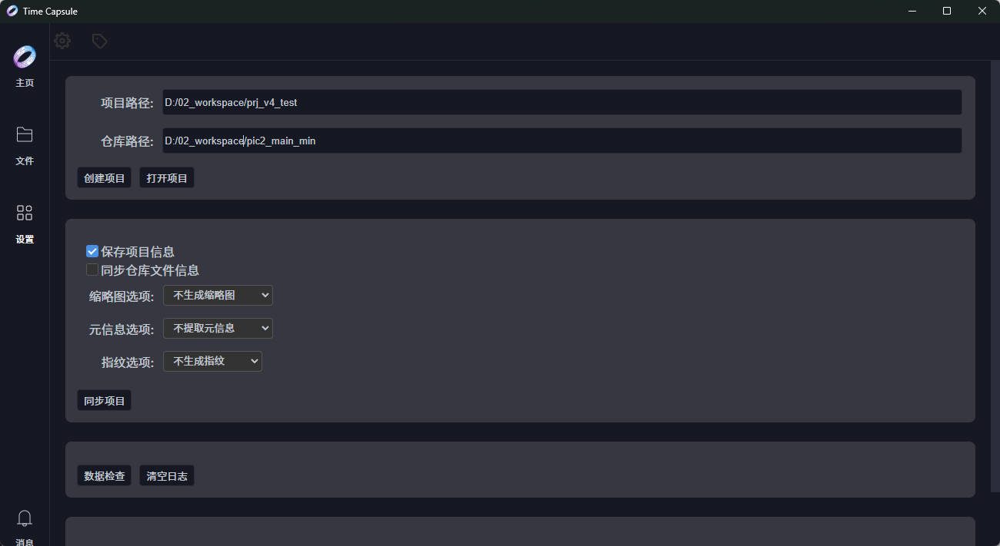
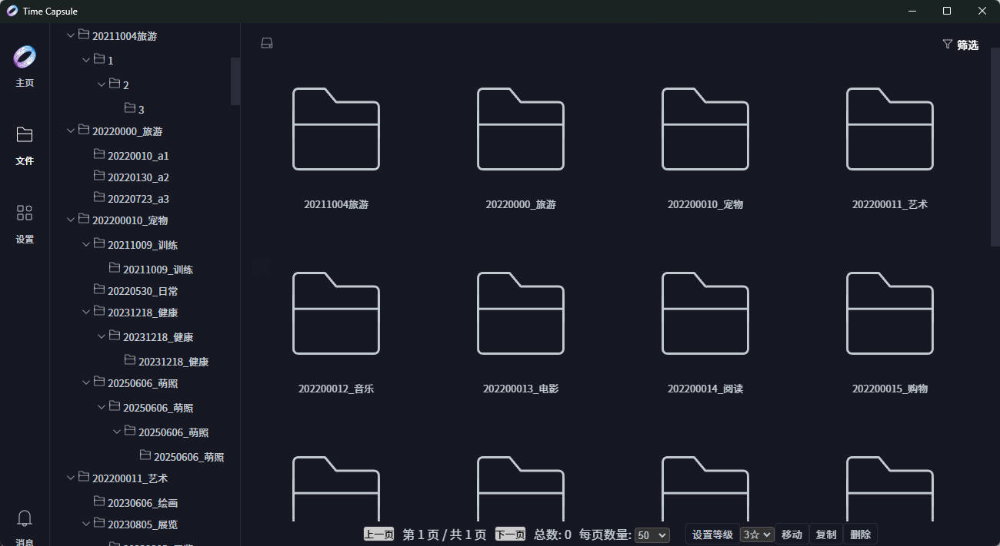
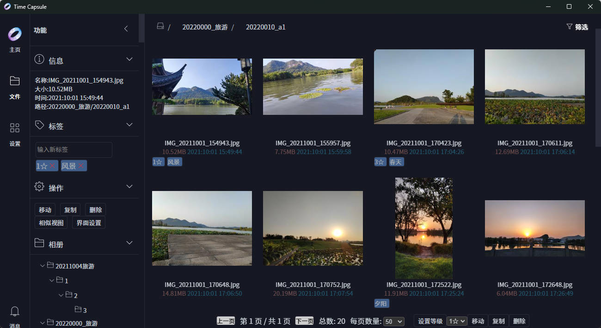

# Time Capsule 用户手册

## 📖 目录

- [产品概述](#产品概述)
- [系统要求](#系统要求)
- [快速开始](#快速开始)
- [核心功能](#核心功能)
  - [文件管理](#文件管理)
  - [标签系统](#标签系统)
  - [搜索与筛选](#搜索与筛选)
  - [相似度检测](#相似度检测)
- [高级功能](#高级功能)
  - [元信息管理](#元信息管理)
  - [文件指纹](#文件指纹)
  - [数据库管理](#数据库管理)
  - [实时更新](#实时更新)
  - [异步任务](#异步任务)
- [最佳实践](#最佳实践)
- [常见问题](#常见问题)
- [技术支持](#技术支持)

---

## 产品概述

Time Capsule 是一款专业的图片与视频管理工具，旨在帮助用户高效地组织和浏览多媒体文件。

### 核心理念

**非侵入式设计**是 Time Capsule 的核心理念。除非用户主动执行删除、复制或移动操作，否则系统不会对用户的原始文件数据进行任何修改。所有元数据、缩略图、指纹等信息均独立存储在项目目录中，确保原始文件的完整性和安全性。

### 产品定位

- **轻量便携**：无需安装配置，即开即用，删除即卸载
- **多端支持**：同时支持 Web 端和桌面端访问
- **安全可靠**：零修改原则，保障用户数据安全
- **高效便捷**：智能搜索、批量操作、实时更新

### 适用场景

- **摄影爱好者**：管理大量照片，按标签分类，快速查找
- **视频创作者**：组织视频素材，管理不同版本
- **数据归档**：建立个人数字资产库，便于长期管理
- **团队协作**：共享文件库，统一管理资源

---

## 系统要求

### 硬件要求

- **处理器**：Intel Core i3 或同等性能处理器
- **内存**：建议 4GB 及以上
- **存储**：至少 1GB 可用空间（用于存储项目数据和缓存）

### 软件要求

- **操作系统**：Windows 7/8/10/11（64 位）
- **浏览器**：Chrome 80+、Firefox 75+、Edge 80+（Web 端）
- **其他**：无需额外安装数据库或运行时环境

### 推荐配置

- **处理器**：Intel Core i5 或更高
- **内存**：8GB 及以上
- **存储**：SSD 硬盘，提升文件扫描和缩略图生成速度

---

## 快速开始

### 1. 启动程序

双击运行 Time Capsule 可执行文件即可启动程序。首次启动时会自动打开设置界面。

### 2. 创建项目

#### 步骤说明

1. 进入设置界面，点击"创建项目"
2. 配置项目路径和仓库路径
3. 点击"创建项目"按钮

#### 路径配置

**项目路径**：存储项目配置文件的路径，包括：
- 数据库文件（.db）
- 缩略图缓存
- 文件元数据
- 系统配置文件

**仓库**：存储图片/视频文件的原始路径，建议选择容量充足、读写速度快的存储位置。



### 3. 同步项目

项目创建成功后，点击"同步项目"按钮开始首次扫描。同步过程包括：

- **扫描仓库**：遍历仓库目录，识别所有文件和文件夹
- **建立索引**：将文件信息保存到数据库
- **生成缩略图**：为图片和视频生成预览缩略图（可选）
- **提取元信息**：提取文件的 EXIF 等元数据（可选）

同步完成后，可返回主页浏览和预览文件。




### 4. 项目管理

#### 打开项目

选择已有的项目文件（JSON 格式）打开项目。

⚠️ **注意**：打开项目后需要重启软件才能正确加载项目信息和文件数据，后续提供优化。

#### 保存项目

将当前项目的配置信息保存到配置文件中，包括：
- 项目路径
- 仓库路径
- 用户偏好设置

---

## 核心功能

### 文件管理

#### 文件浏览

Time Capsule 提供直观的文件浏览界面，支持：
- **树形目录**：按文件夹层级浏览
- **网格视图**：缩略图网格展示
- **列表视图**：详细信息列表展示
- **分页加载**：大数据量场景下自动分页

#### 文件操作

##### 复制文件

将文件复制到指定文件夹，操作流程：
1. 选择需要复制的文件（支持多选）
2. 点击"复制"按钮或使用快捷键 `Ctrl + C`
3. 选择目标文件夹
4. 确认复制操作

##### 移动文件

将文件从一个文件夹移动到另一个文件夹，操作流程：
1. 选择需要移动的文件（支持多选）
2. 点击"移动"按钮或使用快捷键 `Ctrl + X`
3. 选择目标文件夹
4. 确认移动操作

##### 删除文件

文件删除采用安全删除机制：
1. 选择需要删除的文件（支持多选）
2. 点击"删除"按钮或使用快捷键 `Delete`
3. 系统将文件移动到回收站目录

**回收站机制**：
- 文件被移动到仓库同级目录下的 `recycle_bin` 文件夹
- 同时记录文件的关键信息（原始路径、删除时间等）
- 如需彻底删除，可直接进入回收站目录手动删除

⚠️ **注意**：当前版本暂不支持文件恢复功能。

#### 批量操作

Time Capsule 支持高效的批量操作：
- **全选文件**：支持全选文件
- **批量复制/移动**：同时选择多个文件进行操作
- **批量删除**：一次性删除多个文件
- **批量添加标签**：为多个文件同时添加标签

### 标签系统

#### 标签创建

在文件预览界面，可以为文件添加自定义标签：
1. 选择需要添加标签的文件
2. 点击"添加标签"按钮
3. 输入标签名称
4. 确认添加

#### 标签操作

##### 添加标签
- 为单个或多个文件添加标签
- 支持快速添加常用标签
- 支持创建新标签

##### 删除标签
- 从文件中移除指定标签
- 支持批量删除标签
- 删除后自动更新文件列表

##### 标签管理
- 统一管理所有标签
- 支持标签重命名
- 支持标签删除
- 查看标签使用统计

#### 标签应用场景

- **按主题分类**：风景、人像、建筑、美食等
- **按时间分类**：2024年、2023年、假期等
- **按地点分类**：北京、上海、巴黎等
- **按状态分类**：已编辑、待处理、已发布等

标签系统支持多标签组合，一个文件可关联多个标签，实现高效的分类管理。

### 搜索与筛选

#### 搜索功能

系统提供强大的多条件组合搜索功能：

##### 文件名搜索
- 支持模糊匹配
- 支持通配符（`*`、`?`）
- 实时显示搜索结果

##### 标签筛选
- 支持单标签筛选
- 支持多标签组合（AND 逻辑）
- 支持标签排除（NOT 逻辑）

##### 文件类型筛选
- 按文件扩展名筛选
- 按文件类型分类（图片、视频、文档等）
- 支持自定义文件类型

##### 日期范围筛选
- 根据文件创建日期筛选
- 根据文件修改日期筛选
- 支持相对日期（最近7天、最近30天等）

##### 文件大小筛选
- 按文件大小范围筛选
- 支持预设大小选项（<1MB、1-10MB、>10MB 等）
- 支持自定义大小范围

##### 组合筛选
支持多条件组合，实现精确搜索：
- 文件名 + 标签 + 日期 + 大小
- 灵活组合，满足各种搜索需求

#### 搜索结果

- **实时更新**：搜索条件变化时实时更新结果
- **分页浏览**：支持分页显示，提升大数据量场景下的性能
- **结果排序**：支持按文件名、大小、日期等字段排序

### 相似度检测

#### 功能概述

系统提供智能的相似文件检测功能，帮助您识别重复或相似的图片/视频文件。

#### 相似度计算

- **基于内容分析**：不依赖文件名或路径，分析文件实际内容
- **智能算法**：采用先进的图像/视频相似度算法
- **高效计算**：优化的计算流程，快速处理大量文件

#### 相似文件分组

- **自动分组**：将相似文件自动分组显示
- **相似度排序**：按相似度高低排序
- **预览对比**：支持并排预览相似文件

#### 阈值设置

- **自定义阈值**：用户可调整相似度检测阈值（0-100%）
- **预设选项**：提供常用阈值预设（严格、中等、宽松）
- **实时预览**：调整阈值时实时预览检测结果

#### 应用场景

##### 去重优化
发现并处理重复文件，节省存储空间：
- 识别完全相同的文件
- 识别高度相似的文件
- 支持批量删除重复文件

##### 版本管理
识别同一场景的不同拍摄版本：
- 找到同一场景的多张照片
- 找到同一视频的不同编辑版本
- 便于选择最佳版本

##### 内容整理
批量整理相似内容的文件：
- 将相似文件移动到同一文件夹
- 为相似文件添加统一标签
- 建立文件之间的关联关系

---

## 高级功能

### 元信息管理

#### EXIF 信息提取

系统自动提取图片文件的 EXIF 元信息：

##### 拍摄信息
- 拍摄时间
- 地理位置（GPS 坐标）
- 拍摄设备信息

##### 设备信息
- 相机型号
- 镜头型号
- 制造商信息

##### 拍摄参数
- 光圈值（F-stop）
- 快门速度
- ISO 感光度
- 焦距
- 曝光补偿

##### 图像信息
- 图像尺寸（分辨率）
- 色彩空间
- 压缩格式

#### 元信息应用

- **按时间筛选**：根据拍摄时间快速定位照片
- **按地点筛选**：根据 GPS 信息查找特定地点的照片
- **按设备筛选**：查找特定相机或镜头拍摄的照片
- **技术分析**：分析拍摄参数，提升摄影技巧

### 文件指纹

#### 指纹生成

为每个文件生成唯一的指纹标识（Hash 值）：

- **算法选择**：支持多种 Hash 算法（MD5、SHA-1、SHA-256）
- **快速计算**：优化的计算流程，高效处理大量文件
- **唯一性保证**：确保每个文件的指纹唯一

#### 指纹应用

##### 文件去重
- 识别完全相同的文件
- 即使文件名不同也能识别
- 支持批量删除重复文件

##### 完整性验证
- 验证文件是否被篡改
- 检测文件传输错误
- 确保数据完整性

##### 相似度检测基础
- 为相似度检测提供基础数据
- 提升检测准确度
- 加快检测速度

### 数据库管理

#### 数据库特性

- **SQLite 数据库**：轻量级、便携式数据库方案
- **零配置**：无需额外安装数据库软件
- **高性能**：优化的查询性能，快速响应
- **跨平台**：支持 Windows、macOS、Linux

#### 数据管理

##### 元数据存储
存储文件的详细元信息：
- 文件基本信息（名称、大小、类型、路径）
- 文件时间信息（创建时间、修改时间、访问时间）
- 文件标签信息
- 文件指纹信息
- 文件缩略图路径

##### 备份恢复
- **手动备份**：支持手动导出数据库文件
- **自动备份**：可配置自动备份策略
- **恢复功能**：从备份文件恢复数据库
- **版本管理**：保留多个备份版本

##### 一致性检查
- **自动检查**：定期检查数据库一致性
- **错误修复**：自动修复常见的数据不一致问题
- **完整性验证**：验证数据库文件的完整性

#### 用户体验

- **无刷新体验**：无需手动刷新页面即可获取最新数据
- **即时反馈**：操作结果即时显示
- **状态可见**：实时查看系统运行状态

### 异步任务

#### 任务队列

系统内置异步任务处理机制：

- **任务队列**：支持多任务并发执行
- **优先级管理**：支持任务优先级设置
- **并发控制**：智能调度，避免系统过载
- **任务持久化**：任务信息持久化存储，支持断点续传

#### 任务类型

##### 扫描任务
- 仓库扫描
- 增量扫描
- 全量扫描

##### 处理任务
- 缩略图生成
- 元信息提取
- 指纹生成
- 相似度检测

#### 任务监控

##### 状态监控
- 实时监控任务执行状态
- 显示任务进度百分比
- 显示任务剩余时间

##### 错误处理
- 完善的异常处理机制
- 自动重试失败任务
- 详细的错误日志记录

---

## 最佳实践

### 项目管理

#### 项目规划

- **单一仓库**：建议一个项目对应一个仓库，避免混乱
- **定期备份**：定期备份项目文件和数据库
- **路径规范**：使用规范的文件夹命名和层级结构

#### 同步策略

- **首次同步**：首次创建项目时建议全量同步
- **日常更新**：日常使用时建议增量同步
- **定期全量**：定期进行全量同步，确保数据一致性

### 文件组织

#### 文件夹结构

建议采用清晰的文件夹结构：
```
仓库/
├── 2024/
│   ├── 春节/
│   ├── 暑假/
│   └── 日常/
├── 2023/
│   ├── 春节/
│   └── 日常/
└── 其他/
    ├── 工作文档/
    └── 个人资料/
```

#### 文件命名

- **统一格式**：使用统一的文件命名格式
- **包含信息**：文件名中包含日期、地点等关键信息
- **避免特殊字符**：避免使用特殊字符和空格

### 标签使用

#### 标签策略

- **层级标签**：使用层级标签（如：旅行 > 日本 > 东京）
- **数量控制**：每个文件标签数量控制在 3-5 个
- **统一规范**：使用统一的标签命名规范

#### 标签维护

- **定期清理**：定期清理不常用的标签
- **标签合并**：合并相似或重复的标签
- **标签统计**：定期查看标签使用统计，优化标签体系

### 性能优化

#### 扫描优化

- **增量扫描**：日常使用时仅扫描新增文件
- **分批处理**：大量文件时分批处理
- **避开高峰**：在系统空闲时进行大规模扫描

#### 缩略图优化

- **按需生成**：仅在需要时生成缩略图
- **尺寸控制**：选择合适的缩略图尺寸
- **质量平衡**：在质量和大小之间找到平衡

#### 数据库优化

- **定期清理**：定期清理数据库中的无效记录
- **索引优化**：定期重建数据库索引
- **数据库压缩**：定期压缩数据库文件

---

## 常见问题

### 基础问题

**Q：Time Capsule 是免费的吗？**
A：是的，Time Capsule 是完全免费的开源软件。

**Q：支持哪些操作系统？**
A：当前版本支持 Windows 7/8/10/11（64 位）。未来计划支持 macOS 和 Linux。

**Q：支持哪些文件格式？**
A：支持常见的图片格式（JPG、PNG、GIF、BMP、WebP 等）和视频格式（MP4、AVI、MOV、MKV、WMV 等）。

**Q：可以管理多少个文件？**
A：理论上没有限制，实际受限于磁盘空间和数据库性能。建议单个项目文件数量不超过 100 万。

### 功能问题

**Q：删除的文件能否恢复？**
A：当前版本暂不支持文件恢复功能。文件将被移动到回收站目录，如需恢复，可手动从回收站目录复制回原位置。

**Q：缩略图生成是否会影响原始文件？**
A：不会。缩略图是独立生成的，存储在项目目录中，不会对原始文件进行任何修改。

**Q：如何提升文件扫描速度？**
A：可通过以下方式优化扫描速度：
- 仅扫描新增文件（增量扫描）
- 暂不生成缩略图
- 暂不提取元信息
- 使用 SSD 硬盘存储仓库

**Q：相似度检测准确吗？**
A：相似度检测基于文件内容分析，准确度较高。但不同场景的相似文件可能被误判，建议人工确认后再删除。

**Q：系统是否支持多用户管理？**
A：当前版本为单用户版本，暂不支持多用户管理功能。未来版本计划支持多用户。

### 技术问题

**Q：数据库文件损坏怎么办？**
A：可以尝试以下方法：
1. 使用数据库一致性检查功能
2. 从最近的备份文件恢复
3. 联系技术支持获取帮助

**Q：如何迁移项目到另一台电脑？**
A：迁移步骤如下：
1. 复制整个项目目录到新电脑
2. 在新电脑上打开项目
3. 重新同步仓库（如果仓库路径变化）

**Q：系统占用多少磁盘空间？**
A：系统占用主要包括：
- 数据库文件：约 1KB/文件（仅元数据）
- 缩略图：约 10-50KB/文件（取决于设置）
- 项目配置：约 1MB

**Q：如何保障数据安全？**
A：系统采用非侵入式设计，不会修改原始文件，所有操作均在数据库层面进行。建议：
- 定期备份项目目录和数据库文件
- 使用可靠的存储设备
- 定期检查数据库一致性

### 故障排除

**Q：程序无法启动怎么办？**
A：请检查：
1. 是否有足够的磁盘空间
2. 是否有杀毒软件阻止运行
3. 查看日志文件了解详细错误信息

**Q：同步速度很慢怎么办？**
A：请检查：
1. 硬盘读写速度是否正常
2. 是否有其他程序占用大量资源
3. 尝试关闭缩略图生成和元信息提取

**Q：搜索结果不准确怎么办？**
A：请检查：
1. 搜索条件是否正确
2. 是否有特殊字符影响搜索
3. 尝试清除搜索条件重新搜索

---

## 技术支持

### 联系方式

如遇到问题或有相关建议，请通过以下方式联系我们：

- **官方网站**：[TimeTidy](https://xutopia77.github.io/page/TimeTidy)
- **下载地址**：[record-manager-latest-win.zip](https://github.com/xutopia77/time_capsule/releases/download/latest/record-manager-latest-win.zip)
- **问题反馈**：[提交 Issue 至项目仓库](https://github.com/xutopia77/time_capsule/issues)

### 文档资源

- **用户手册**：本文档
- **API 文档**：[API 参考文档](https://github.com/xutopia77/time_capsule/blob/main/doc/api.md)
- **开发文档**：[开发者指南](https://github.com/xutopia77/time_capsule/blob/main/doc/development.md)
- **常见问题**：[FAQ 页面](https://github.com/xutopia77/time_capsule/wiki/FAQ)

### 社区支持

- **GitHub Discussions**：[参与讨论](https://github.com/xutopia77/time_capsule/discussions)
- **用户交流群**：加入用户交流群（见官网）
- **更新通知**：关注 GitHub Releases 获取最新版本通知

---

**文档版本**：v6.0.1  
**最后更新**：2024-03-13  
**适用版本**：Time Capsule v6.0.1+
